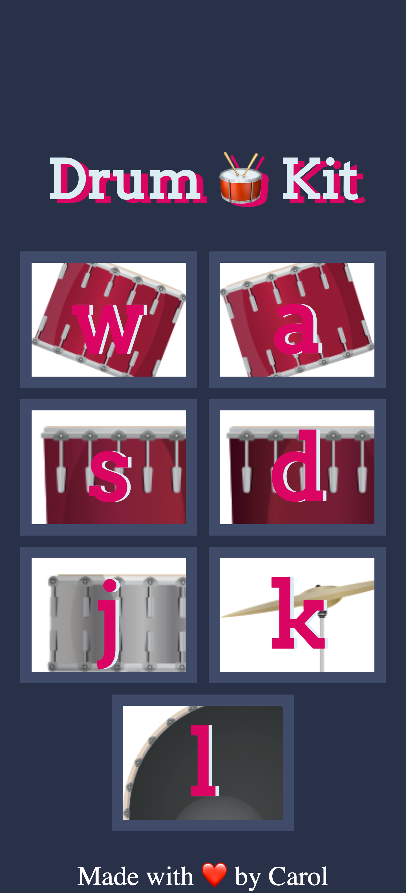

# Drum Kit 🥁

Drum Kit is an online drum. Each button makes the sound of a part of a drum. If you prefer, you can use the keyboard instead. The purpose of this project was to practice modules with JavaScript, playing audio and grid.

### Check out Drum Kit [here](drumkitonlineplay.netlify.app)

## Development Process

- Downloading resources from the JavaScript course;
- Development of the user interface from a mobile-first perspective;
- Creating components dynamically using JS;
- Getting the audio to be played;
- Adding event listener for key-down to enable the use of the keyboard;
- Adjusting the user interface.

## Built with 🏗️

- Semantic HTML5 markup;
- JS modules;
- Mobile-first workflow.

## Technologies and Tools 🛠️

- [HTML5](https://html.com)
- [CSS3](https://www.w3.org/Style/CSS/)
- [JavaScript](https://www.javascript.com)

## Requirements ✅ 

To work with the code, you will need, before you begin, to install it in your machine Git and to have a source-code editor such as [VSCode] (https://code.visualstudio.com).

## What I learned 🤓

### Sharpened my skills at creating component files:

- Organized the components separately;
- Dynamically added the elements into the DOM;
- Using objects for a clean and modular code.

### Playing songs with the play() method:

- Learning how to play sounds with JS module play();

~~~
const playSound = (soundSrc) => {
    const audio = new Audio(soundSrc);
    audio.play();
}

export default playSound
~~~

### Improved my skills with CSS Grid and responsive design:

- Get the user interface to be responsive using "minmax" into columns and rows. The use of "minmax" allows the elements to adapt to different screen sizes. For instance, it specifies a size range for a column and/or a row. If the defined range is from 0 to 1fr, it means that the column/row can shrink to a minimum size of 0 pixels if there is not enough content inside. It can also expand to occupy the available space evenly, taking 1 fraction (maximum) of the available space inside the grid.

~~~
 .instrumentContainer {
        grid-template-columns: repeat(2, minmax(0, 1fr));
        grid-template-rows: repeat(3, minmax(0, 1fr)); 
        box-sizing: border-box;
        gap: 30px;
        width: 90%;
    }
~~~

### Made with :heart: by [Caroline Almeida Nikolic] (https://www.linkedin.com/in/carolinealmeidanikolic/)